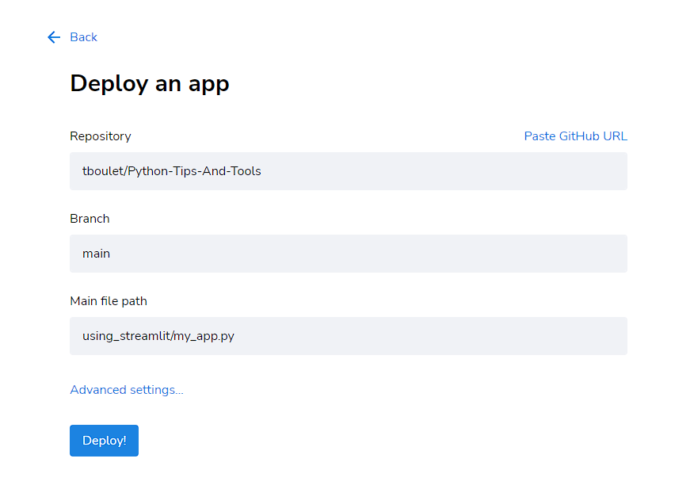

# Using Streamlit to deploy your ML app

This is a simple example of how to deploy a machine learning model online using Streamlit. The benefits of streamlit are :
- great GUI when using it online
- it is very convenient to debug your app in local
- it is easy to deploy from local to Streamlit servers

## Install

```bash
pip install streamlit
```

## Create your app

Your app will have to be created as a python file, my_app.py for example.

The app is typically a form with a button. When the button is clicked, the app runs the prediction and displays the result. Check the [Streamlit documentation](https://docs.streamlit.io/en/stable/) for more details.

## Run your app in local

This will open a new tab in your browser with your app. Each time the source code is modified, the app is automatically reloaded, which is extremely convenient for debugging.

```bash
streamlit run my_app.py
# or
python -m streamlit my_app.py
```

## Deploy your app to Streamlit servers

Once you are happy with your app, you can deploy it to Streamlit servers. Go on [Streamlit sharing](https://share.streamlit.io/), click on "New app" and fill the form. You will be asked to provide a link to your app on GitHub. Once the app is deployed, you will be given a link to your app, it can be shared with anyone. The app is automatically reloaded each time you push a new version to GitHub. 

<p align="center">
  
</p>

Remark : Streamlit regularly put unused app to sleep.
